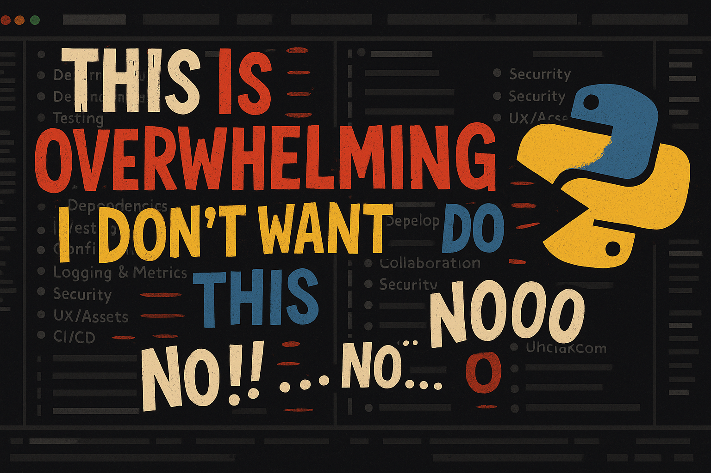

# Modular Project Planner

<strong>1. Project Overview</strong>

**Modular Project Planner** is a flexible planning toolkit designed to guide users step-by-step through actionable workflows.  
It also raises awareness about hostile procedural tactics—particularly in custody-related legal cases—and empowers communities to respond to systemic access barriers.

---

<strong>2. Modular Focused</strong>

Each project module focuses on a specific problem area, beginning with equitable access to digital legal resources.

The issues start at the beginning: **Deprived of access.**  
To kick-start this project, the first modulated project addresses how to secure and maintain access to digital legal tools in a constantly evolving environment.

> Solutions to solve today.  
> Breadcrumbs left behind for tomorrow.

---

<strong>3. Download</strong>

You can clone or download this tagged layer to begin a fresh build using just the foundational module structure.

---

<strong>4. 📌 Current Snapshot</strong>

> **foundation-layer**: Core structure + modular scaffolding established.  
> Optional components tucked away for rebuild clarity.  
> This tag represents the ground layer from which all future modules build.

---

<strong>🔒 Governance</strong>

This repository follows a protected-branch ruleset to maintain integrity across all core modules.  
- 🔐 [Branch Protection Ruleset](.github/rulesets/branch-protection-ruleset.json)
- 🛡️ [Security Policy](.github/rulesets/SECURITY.md)  
- ✍️ [Contribution Guidelines](CONTRIBUTING.md)

---

© 2025 Missa.
Last updated: June 10, 2025